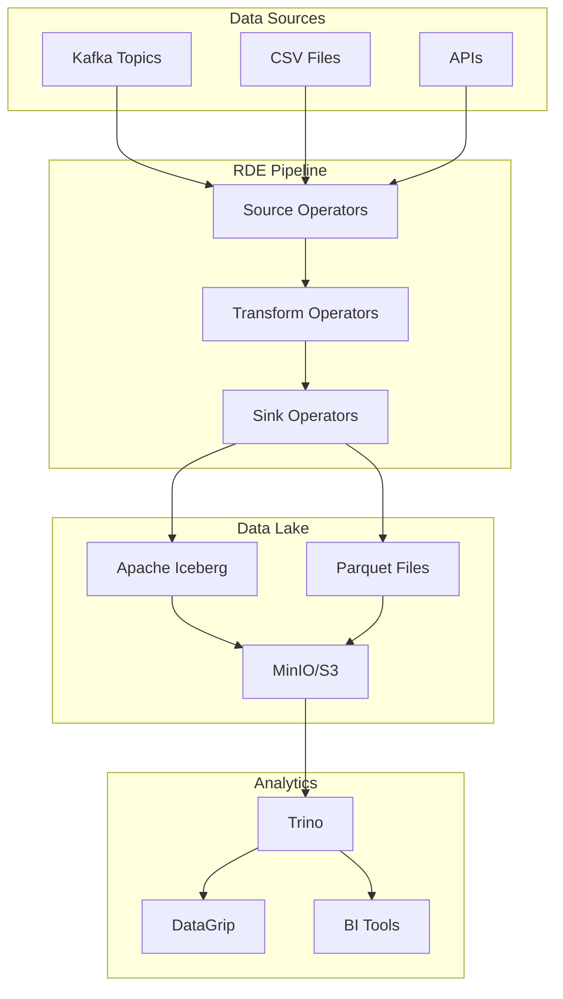

# RDE - Rust Data Engineering

<div align="center">

[](https://github.com/lyteabovenyte/rde)
[](https://www.rust-lang.org)
[](https://arrow.apache.org)
[](LICENSE)

**High-Performance Real-Time Data Engineering Pipeline in Rust**

*Building the future of streaming data processing with Apache Arrow, DataFusion, and Apache Iceberg*

[Features](#-features) •
[Quick Start](#-quick-start) •
[Architecture](#-architecture) •
[Documentation](#-documentation) •
[Examples](#-examples) •
[Contributing](#-contributing)

</div>

---

## 🚀 Overview

RDE (Rust Data Engineering) is a high-performance, real-time data engineering framework built in Rust. It provides a complete solution for streaming data processing, from ingestion through transformation to storage, leveraging the power of Apache Arrow, DataFusion, and Apache Iceberg.

### Why RDE?

- **🏃‍♂️ High Performance**: Built with Rust for maximum speed and memory efficiency
- **🔄 Real-Time Processing**: Stream processing with millisecond latencies
- **📊 Modern Data Stack**: Apache Arrow, DataFusion, and Iceberg integration
- **🧩 Modular Architecture**: Composable operators for flexible pipeline construction
- **🛡️ Type Safety**: Compile-time guarantees for data pipeline correctness
- **📈 Scalable**: Horizontal scaling with Kafka and distributed processing
- **🔍 Observable**: Built-in metrics, logging, and monitoring capabilities

## ✨ Features

### 🎯 Data Sources
- **Kafka**: Real-time streaming with JSON schema inference and evolution
- **CSV Files**: Batch processing with automatic schema detection
- **Custom Sources**: Extensible source interface for any data system

### 🔧 Transformations
- **Schema Evolution**: Dynamic schema inference and evolution for changing data
- **JSON Flattening**: Convert nested JSON to flat relational structures
- **SQL Transformations**: Complex business logic using DataFusion SQL engine
- **Data Cleaning**: Remove nulls, trim strings, normalize case, and more
- **Partitioning**: Add partition columns for optimized analytics
- **Custom Transforms**: Build domain-specific transformations

### 💾 Data Sinks
- **Apache Iceberg**: Production-grade data lake tables with ACID transactions
- **Parquet**: High-performance columnar storage with compression
- **Console Output**: Development and debugging support
- **Custom Sinks**: Extensible sink interface for any target system

### 🎛️ Advanced Features
- **Topic-to-Table Mapping**: Direct Kafka-to-Iceberg streaming
- **Automatic Schema Evolution**: Handle changing data structures seamlessly
- **SQL Analytics**: Query your data with Trino and DataGrip integration
- **Monitoring**: Comprehensive observability and health monitoring
- **Production Ready**: Docker deployment with infrastructure automation

## 🏗️ Architecture



### Core Components

- **Pipeline Engine**: High-performance message passing between operators
- **Schema Registry**: Automatic schema inference and evolution tracking
- **Transformation Engine**: DataFusion-powered SQL and custom transformations
- **Storage Layer**: Apache Iceberg integration with ACID guarantees
- **Query Engine**: Trino integration for SQL analytics

## 🚀 Quick Start

### Prerequisites

- **Rust 1.70+** - [Install Rust](https://rustup.rs/)
- **Docker** - [Install Docker](https://docs.docker.com/get-docker/)
- **Git** - Version control

### Installation

```bash
# Clone the repository
git clone https://github.com/lyteabovenyte/rde.git
cd rde

# Build the project
cargo build --release

# Start infrastructure (Kafka, MinIO, Trino)
docker-compose -f docker/docker-compose.yml up -d
```

### Your First Pipeline

1. **Create a simple pipeline configuration:**

```yaml
# examples/my-first-pipeline.yml
name: "my-first-pipeline"
sources:
  - type: kafka
    id: "kafka-source"
    brokers: "localhost:9092"
    group_id: "my-pipeline-group"
    topic: "input-data"

transforms:
  - type: clean_data
    id: "clean-data"
    remove_nulls: true
    trim_strings: true

sinks:
  - type: iceberg
    id: "iceberg-sink"
    table_name: "my_table"
    bucket: "iceberg-data"
    endpoint: "http://localhost:9000"
    access_key: "minioadmin"
    secret_key: "minioadmin"
    region: "us-east-1"

edges:
  - ["kafka-source", "clean-data"]
  - ["clean-data", "iceberg-sink"]
```

2. **Run the pipeline:**

```bash
cargo run --bin rde-cli -- --pipeline examples/my-first-pipeline.yml
```

3. **Stream some test data:**

```bash
# Generate and stream test data
echo '{"id": 1, "name": "Alice", "age": 30}' | \
cargo run --bin kafka-producer -- \
  --input /dev/stdin \
  --topic input-data \
  --format ndjson
```

4. **Query your data:**

```bash
# Start Trino for SQL analytics
./scripts/setup-trino.sh

# Query your data
./scripts/run-sql.sh "SELECT * FROM iceberg.default.my_table"
```

## 📖 Documentation

### API Documentation

Generate and view the complete API documentation:

```bash
cargo doc --open
```

### Configuration Reference

- **[Pipeline Configuration](docs/configuration.md)** - Complete YAML configuration reference
- **[Source Operators](docs/sources.md)** - Available data source connectors
- **[Transform Operators](docs/transforms.md)** - Data transformation options
- **[Sink Operators](docs/sinks.md)** - Output destination configurations

### Guides

- **[Getting Started Guide](docs/getting-started.md)** - Step-by-step tutorial
- **[Schema Evolution](docs/schema-evolution.md)** - Handling changing data structures
- **[SQL Transformations](docs/sql-transforms.md)** - Using DataFusion SQL
- **[Iceberg Integration](docs/iceberg.md)** - Working with data lakes
- **[Monitoring & Observability](docs/monitoring.md)** - Production monitoring
- **[Performance Tuning](docs/performance.md)** - Optimization guidelines

### Integration Guides

- **[Trino + DataGrip Setup](TRINO-DATAGRIP-SETUP.md)** - SQL analytics setup
- **[Kafka Integration](docs/kafka.md)** - Streaming data ingestion
- **[Docker Deployment](docs/deployment.md)** - Production deployment guide

## 💡 Examples

### Real-Time Analytics Pipeline

Process live e-commerce events with schema evolution:

```yaml
name: "ecommerce-analytics"
sources:
  - type: kafka
    id: "events-source"
    brokers: "localhost:9092"
    topic: "user-events"
    topic_mapping:
      iceberg_table: "user_events"
      auto_schema_evolution: true
      sql_transform: |
        SELECT 
          user_id,
          event_type,
          timestamp,
          CASE 
            WHEN event_type = 'purchase' THEN amount
            ELSE 0 
          END as revenue,
          DATE(timestamp) as partition_date
        FROM input_data
        WHERE user_id IS NOT NULL
```

### Batch ETL Pipeline

Process large CSV files with transformations:

```yaml
name: "sales-etl"
sources:
  - type: csv
    id: "sales-files"
    path: "data/sales/*.csv"
    has_header: true
    batch_rows: 10000

transforms:
  - type: sql_transform
    id: "enrich-sales"
    query: |
        SELECT 
          *,
        amount * 1.1 as amount_with_tax,
        CASE 
          WHEN amount > 1000 THEN 'high-value'
          ELSE 'standard'
        END as order_tier
      FROM input_data
```

### Stream Processing with Windowing

Real-time aggregations with time windows:

```yaml
name: "metrics-aggregation"
transforms:
- type: sql_transform
    id: "window-aggregation"
  query: |
    SELECT 
        window_start,
        window_end,
        COUNT(*) as event_count,
        AVG(amount) as avg_amount,
        SUM(amount) as total_amount
      FROM TABLE(
        TUMBLE(TABLE input_data, DESCRIPTOR(timestamp), INTERVAL '1' MINUTE)
      )
      GROUP BY window_start, window_end
```

## 🛠️ Development

### Building from Source

```bash
# Clone and build
git clone https://github.com/lyteabovenyte/rde.git
cd rde
cargo build --release

# Run tests
cargo test

# Check code quality
cargo clippy
cargo fmt
```

### Project Structure

```
rde/
├── crates/
│   ├── rde-core/          # Core traits and types
│   ├── rde-io/            # Source and sink implementations  
│   └── rde-tx/            # Transform implementations
├── bins/
│   ├── rde-cli/           # Main pipeline runner
│   └── kafka-producer/    # Data streaming utility
├── examples/              # Example pipeline configurations
├── scripts/               # Automation and utility scripts
├── sql/                   # SQL analytics queries
└── docs/                  # Documentation
```

### Contributing

We welcome contributions! Please see our [Contributing Guide](CONTRIBUTING.md) for details.

1. Fork the repository
2. Create your feature branch (`git checkout -b feature/amazing-feature`)
3. Commit your changes (`git commit -m 'Add amazing feature'`)
4. Push to the branch (`git push origin feature/amazing-feature`)
5. Open a Pull Request

## 📊 Performance

RDE is designed for high-performance data processing:

- **Throughput**: Process millions of records per second
- **Latency**: Sub-millisecond processing latency
- **Memory**: Efficient Arrow-based columnar processing
- **Scaling**: Horizontal scaling with Kafka partitioning
- **Storage**: High-compression Parquet with Iceberg optimizations

### Benchmarks

| Workload | Throughput | Latency | Memory |
|----------|------------|---------|---------|
| JSON Processing | 1M+ msgs/sec | <1ms | 100MB |
| CSV Processing | 500K+ rows/sec | <2ms | 50MB |
| SQL Transforms | 2M+ rows/sec | <5ms | 200MB |
| Iceberg Writes | 100K+ rows/sec | <10ms | 150MB |

## 🔧 Configuration

### Environment Variables

```bash
# Logging configuration
export RUST_LOG=info

# Performance tuning
export BATCH_SIZE=10000
export CHANNEL_CAPACITY=1000

# Storage configuration
export ICEBERG_WAREHOUSE=s3://my-bucket/warehouse
export S3_ENDPOINT=http://localhost:9000
```

### Production Configuration

For production deployments, see our [Production Guide](docs/production.md) with recommendations for:

- Resource allocation and tuning
- Monitoring and alerting setup  
- Security configurations
- High availability deployment patterns

## 🌟 Ecosystem

RDE integrates seamlessly with the modern data stack:

### Storage
- **Apache Iceberg** - ACID transactions and schema evolution
- **Apache Parquet** - Columnar storage format
- **MinIO/S3** - Object storage for data lakes

### Processing  
- **Apache Arrow** - In-memory columnar format
- **DataFusion** - Query execution engine
- **Apache Kafka** - Streaming data platform

### Analytics
- **Trino** - Distributed SQL query engine
- **Apache Superset** - Business intelligence
- **Jupyter** - Data science and exploration

## 📈 Roadmap

### Version 2.1 (Next Release)
- [ ] Apache Avro support
- [ ] Kubernetes operator
- [ ] REST API for pipeline management
- [ ] Enhanced monitoring dashboards

### Version 2.2
- [ ] Apache Flink integration
- [ ] Delta Lake support  
- [ ] Machine learning transformations
- [ ] Stream SQL improvements

### Version 3.0
- [ ] Distributed execution engine
- [ ] Auto-scaling capabilities
- [ ] Advanced optimization rules
- [ ] Cloud-native deployment

## 📄 License

This project is licensed under the MIT License - see the [LICENSE](LICENSE) file for details.

## 🤝 Support

- **Documentation**: [docs/](docs/)
- **Issues**: [GitHub Issues](https://github.com/lyteabovenyte/rde/issues)
- **Discussions**: [GitHub Discussions](https://github.com/lyteabovenyte/rde/discussions)
- **Email**: [Email](mailto:lyteabovenyte@gmail.com)

## 🎯 Built With

- **[Rust](https://www.rust-lang.org/)** - Systems programming language
- **[Apache Arrow](https://arrow.apache.org/)** - Columnar memory format
- **[DataFusion](https://arrow.apache.org/datafusion/)** - Query execution engine
- **[Apache Iceberg](https://iceberg.apache.org/)** - Table format for data lakes
- **[rdkafka](https://github.com/fede1024/rust-rdkafka)** - Kafka client for Rust
- **[Tokio](https://tokio.rs/)** - Asynchronous runtime
- **[Serde](https://serde.rs/)** - Serialization framework

---

<div align="center">

**[⭐ Star us on GitHub](https://github.com/lyteabovenyte/rde) if RDE helps power your data pipelines!**

</div>