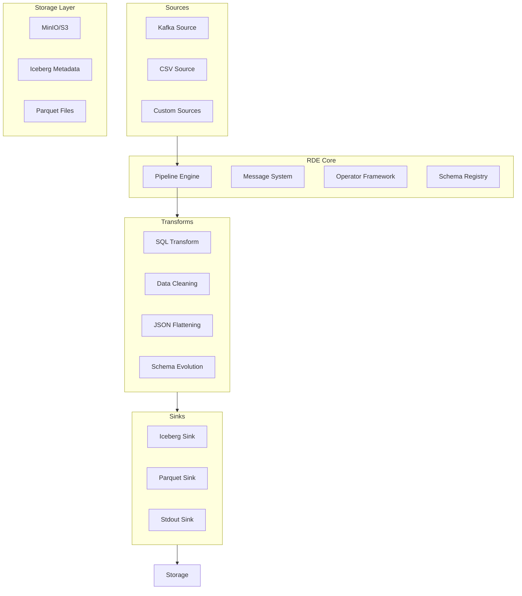
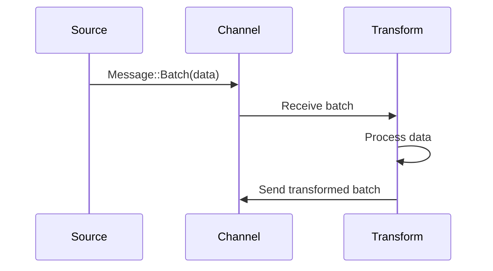
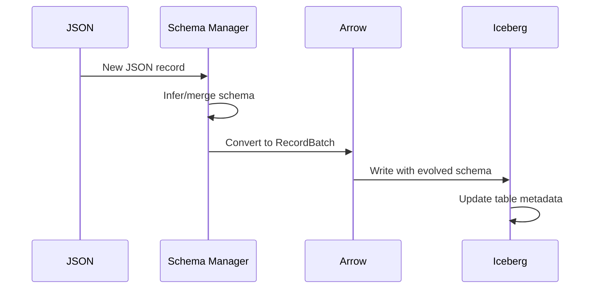
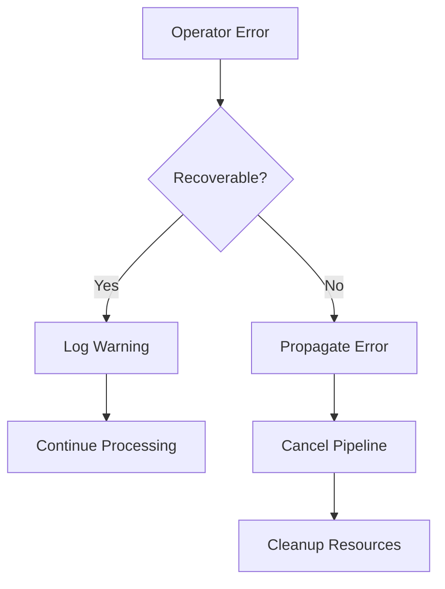
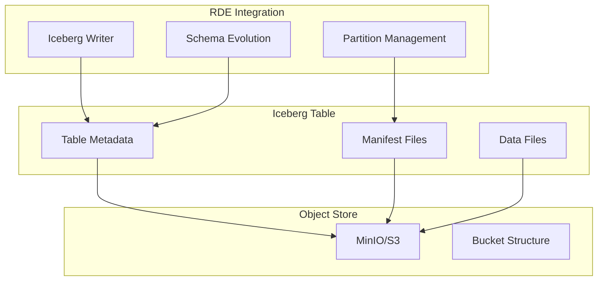
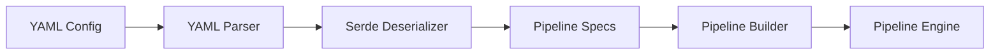

# RDE Architecture

This document provides a deep dive into RDE's architecture, design principles, and internal components.

## Overview

RDE is built as a modular, high-performance data processing engine with the following core principles:

- **Type Safety**: Compile-time guarantees for pipeline correctness
- **Zero-Copy Processing**: Minimal data copying using Apache Arrow
- **Async Processing**: Non-blocking I/O and concurrent execution
- **Fault Tolerance**: Graceful error handling and recovery
- **Extensibility**: Plugin architecture for custom operators

## System Architecture



## Core Components

### 1. Message System

The message system provides type-safe communication between operators:

```rust
pub enum Message {
    Batch(RecordBatch),    // Data payload
    Watermark(i64),        // Event time progress
    Eos,                   // End of stream
}
```

**Design Features:**
- **Bounded Channels**: Backpressure control and memory management
- **Zero-Copy**: Arrow RecordBatch shared via Arc<>
- **Async Processing**: Non-blocking message passing
- **Flow Control**: Watermarks for time-based operations

### 2. Operator Framework

Three operator types form the building blocks:

```rust
#[async_trait]
pub trait Source: Operator {
    async fn run(&mut self, tx: BatchTx, cancel: CancellationToken) -> Result<()>;
}

#[async_trait]
pub trait Transform: Operator {
    async fn run(&mut self, rx: BatchRx, tx: BatchTx, cancel: CancellationToken) -> Result<()>;
}

#[async_trait]
pub trait Sink: Operator {
    async fn run(&mut self, rx: BatchRx, cancel: CancellationToken) -> Result<()>;
}
```

**Design Features:**
- **Uniform Interface**: Common patterns across all operators
- **Graceful Shutdown**: Cancellation token propagation
- **Error Propagation**: Structured error handling
- **Schema Tracking**: Type-safe data flow

### 3. Schema Registry

Dynamic schema management for evolving data:

```rust
pub struct DynamicSchemaManager {
    current_schema: SchemaRef,
    evolution_history: Vec<SchemaRef>,
    field_mappings: HashMap<String, usize>,
}
```

**Capabilities:**
- **Automatic Inference**: JSON to Arrow schema conversion
- **Schema Evolution**: Backward-compatible schema changes
- **Type Promotion**: Safe type conversions (i32 -> i64, etc.)
- **Field Addition**: New fields with default values

### 4. Pipeline Engine

The engine orchestrates operator execution:

```rust
pub struct PipelineEngine {
    operators: HashMap<String, OperatorHandle>,
    channels: HashMap<String, (BatchTx, BatchRx)>,
    cancel_token: CancellationToken,
}
```

**Execution Model:**
- **Async Tasks**: Each operator runs in its own async task
- **Graph Execution**: Topological ordering of operators
- **Resource Management**: Channel capacity and memory limits
- **Monitoring**: Performance metrics and health checks

## Data Flow

### 1. Data Ingestion



### 2. Schema Evolution



### 3. Error Handling



## Performance Characteristics

### Memory Management

- **Zero-Copy**: Arrow data shared between operators
- **Bounded Channels**: Configurable backpressure
- **Pool Allocation**: Object reuse for hot paths
- **Lazy Evaluation**: On-demand data loading

### Concurrency Model

- **Async Runtime**: Tokio-based non-blocking execution
- **Operator Isolation**: Independent async tasks
- **Channel Buffering**: Tunable queue depths
- **Graceful Shutdown**: Coordinated cancellation

### I/O Optimization

- **Batched Processing**: Configurable batch sizes
- **Compression**: Automatic compression for storage
- **Columnar Format**: Arrow's efficient memory layout
- **Vectorized Operations**: SIMD-accelerated processing

## Storage Architecture

### Iceberg Integration



### Data Layout

```
iceberg-data/
├── table_name/
│   ├── metadata/
│   │   ├── version-hint.text
│   │   ├── v1.metadata.json
│   │   └── v2.metadata.json
│   ├── data/
│   │   ├── partition_col=value1/
│   │   │   ├── file1.parquet
│   │   │   └── file2.parquet
│   │   └── partition_col=value2/
│   │       └── file3.parquet
│   └── snapshots/
│       ├── snap-1.avro
│       └── snap-2.avro
```

## Extension Points

### Custom Sources

Implement the `Source` trait:

```rust
pub struct MyCustomSource {
    id: String,
    schema: SchemaRef,
    // Custom fields
}

#[async_trait]
impl Source for MyCustomSource {
    async fn run(&mut self, tx: BatchTx, cancel: CancellationToken) -> Result<()> {
        // Custom implementation
    }
}
```

### Custom Transforms

Implement the `Transform` trait:

```rust
pub struct MyCustomTransform {
    id: String,
    schema: SchemaRef,
    // Custom logic
}

#[async_trait]
impl Transform for MyCustomTransform {
    async fn run(&mut self, rx: BatchRx, tx: BatchTx, cancel: CancellationToken) -> Result<()> {
        // Custom processing
    }
}
```

### Custom Sinks

Implement the `Sink` trait:

```rust
pub struct MyCustomSink {
    id: String,
    schema: SchemaRef,
    // Custom configuration
}

#[async_trait]
impl Sink for MyCustomSink {
    async fn run(&mut self, rx: BatchRx, cancel: CancellationToken) -> Result<()> {
        // Custom output logic
    }
}
```

## Configuration System

### YAML Processing



### Runtime Instantiation

```rust
pub fn build_pipeline(spec: PipelineSpec) -> Result<PipelineEngine> {
    let mut builder = PipelineBuilder::new();
    
    // Build operators from specs
    for source_spec in spec.sources {
        let source = build_source(source_spec)?;
        builder.add_source(source);
    }
    
    // Connect operators based on edges
    for (from, to) in spec.edges {
        builder.connect(&from, &to)?;
    }
    
    builder.build()
}
```

## Monitoring and Observability

### Metrics Collection

- **Throughput**: Messages/second per operator
- **Latency**: End-to-end processing time
- **Memory Usage**: Peak and current memory consumption
- **Error Rates**: Failed operations per operator

### Logging Framework

```rust
use tracing::{info, warn, error, debug};

// Structured logging with context
info!(
    operator_id = %self.id,
    batch_size = batch.num_rows(),
    "Processing batch"
);
```

### Health Checks

- **Operator Status**: Running, failed, completed
- **Channel Health**: Queue depths and backpressure
- **Resource Usage**: CPU, memory, I/O utilization
- **External Dependencies**: Kafka, MinIO connectivity

## Security Considerations

### Data Protection

- **Encryption in Transit**: TLS for Kafka and S3 connections
- **Encryption at Rest**: S3 server-side encryption
- **Access Control**: IAM and bucket policies
- **Credential Management**: Environment variables and secrets

### Network Security

- **VPC Isolation**: Private network deployment
- **Firewall Rules**: Minimal port exposure
- **Certificate Management**: Automated cert rotation
- **Audit Logging**: Security event tracking

## Deployment Patterns

### Development

```yaml
# docker/docker-compose.yml for local development
services:
  kafka:
    image: confluentinc/cp-kafka:latest
  minio:
    image: quay.io/minio/minio:latest
  rde:
    build: .
    depends_on: [kafka, minio]
```

### Production

```yaml
# Kubernetes deployment
apiVersion: apps/v1
kind: Deployment
metadata:
  name: rde-pipeline
spec:
  replicas: 3
  selector:
    matchLabels:
      app: rde-pipeline
  template:
    spec:
      containers:
      - name: rde
        image: rde:v2.0.0
        resources:
          requests:
            memory: "512Mi"
            cpu: "500m"
          limits:
            memory: "2Gi"
            cpu: "2"
```

## Future Architecture

### Distributed Execution

- **Worker Nodes**: Multi-node pipeline execution
- **Load Balancing**: Automatic task distribution
- **Fault Tolerance**: Node failure recovery
- **State Management**: Distributed checkpointing

### Stream Processing Enhancements

- **Windowing**: Time and count-based windows
- **Joins**: Stream-stream and stream-table joins
- **Aggregations**: Incremental aggregation processing
- **Complex Event Processing**: Pattern matching and correlation

This architecture enables RDE to provide high-performance, reliable data processing with strong type safety and excellent developer experience.
